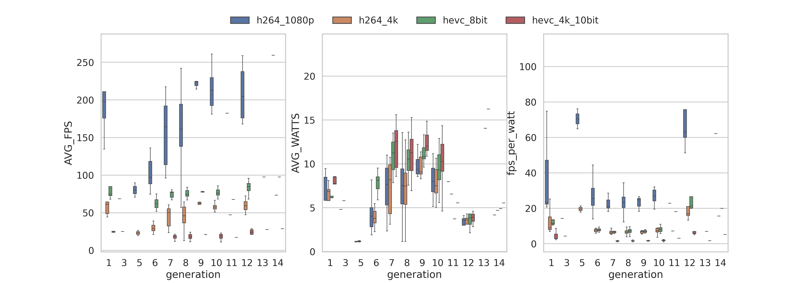

Runs an ffmpeg benchmark to get Average Speed, FPS, and Watts. With options to understand max concurrent encodes.
===========================================

The purpose of this script is to benchmark Intel Quick Sync Video performance in integrated iGPUs using a standardised video. More information and rationale is available [at blog.ktz.me](https://blog.ktz.me/i-need-your-help-with-intel-quick-sync-benchmarking/).

Some conclusions and analysis has now been performed (May 2024), you can read about it [https://blog.ktz.me/the-best-media-server-cpu-in-the-world/](https://blog.ktz.me/the-best-media-server-cpu-in-the-world/).

REQUIREMENTS
------------

Requires Docker, Intel CPU w/ QuickSync, printf, and intel-gpu-tools package. Designed for Linux. Tested on Proxmox 8 and Ubuntu 22.04.

This should be run as root with no other applications/containers running that would utilize quicksync. This includes Desktop Environments.

RESULTS PLOT
------------

Here's a plot of all results run to date from the results [Gist](https://gist.github.com/ironicbadger/5da9b321acbe6b6b53070437023b844d) - thanks to [u/Alicimo](https://github.com/Alicimo) for this. It's updated weekly via an automated action.




HOW TO USE
------------

Full instructions available at [blog.ktz.me](https://blog.ktz.me/i-need-your-help-with-intel-quick-sync-benchmarking/).

```
# connect to the system you want the benchmark on (likely via ssh)
ssh user@hostname

# install a couple of dependencies (script tested on proxmox 8 + ubuntu 22.04)
apt install docker.io jq bc intel-gpu-tools git

# clone the git repo with the script
git clone https://github.com/ironicbadger/quicksync_calc.git

# change directory into the cloned repo
cd quicksync_calc

# download the test videos
./video-download.sh

# run the benchmark
./quicksync-benchmark.sh

# copy your results into the following github gist as a comment
https://gist.github.com/ironicbadger/5da9b321acbe6b6b53070437023b844d
```


Check out the results.

SAMPLE OUTPUTS
------------
```bash
CPU      TEST            FILE                        BITRATE     TIME      AVG_FPS  AVG_SPEED  AVG_WATTS
i5-9500  h264_1080p_cpu  ribblehead_1080p_h264       18952 kb/s  59.665s   58.03    2.05x      N/A
i5-9500  h264_1080p      ribblehead_1080p_h264       18952 kb/s  15.759s   232.03   7.63x      7.66
i5-9500  h264_4k         ribblehead_4k_h264          46881 kb/s  58.667s   59.21    2.09x      7.49
i5-9500  hevc_8bit       ribblehead_1080p_hevc_8bit  14947 kb/s  45.369s   76.10    2.66x      9.09
i5-9500  hevc_4k_10bit   ribblehead_4k_hevc_10bit    44617 kb/s  176.932s  19.71    .68x       10.12
```

```bash
CPU       TEST            FILE                        BITRATE     TIME      AVG_FPS  AVG_SPEED  AVG_WATTS
i5-8500T  h264_1080p_cpu  ribblehead_1080p_h264       18952 kb/s  87.080s   42.86    1.46x      N/A
i5-8500T  h264_1080p      ribblehead_1080p_h264       18952 kb/s  18.928s   182.45   6.31x      9.09
i5-8500T  h264_4k         ribblehead_4k_h264          46881 kb/s  69.238s   49.52    1.75x      9.04
i5-8500T  hevc_8bit       ribblehead_1080p_hevc_8bit  14947 kb/s  45.061s   76.42    2.67x      11.93
i5-8500T  hevc_4k_10bit   ribblehead_4k_hevc_10bit    44617 kb/s  185.816s  18.85    .65x       13.13
```


```Concurrent Output
Test Type	1	2	3	4	5	6	7	8	9	10	11	12	13	14
h264_1080p_cpu	1.67x	0.82x	–	–	–	–	–	–	–	–	–	–	–	–
h264_1080p	11.58x	5.98x	4.01x	3.01x	2.59x	2.01x	1.73x	1.54x	1.37x	1.23x	1.12x	1.00x	0.90x	–
h264_4k	3.33x	1.78x	1.19x	0.85x	–	–	–	–	–	–	–	–	–	–
hevc_8bit	10.37x	7.22x	4.81x	3.59x	2.88x	2.40x	2.06x	1.80x	1.60x	1.44x	1.31x	1.20x	1.09x	0.88x
hevc_4k_10bit	2.40x	1.67x	1.08x	0.80x	–	–	–	–	–	–	–	–	–	–
```
